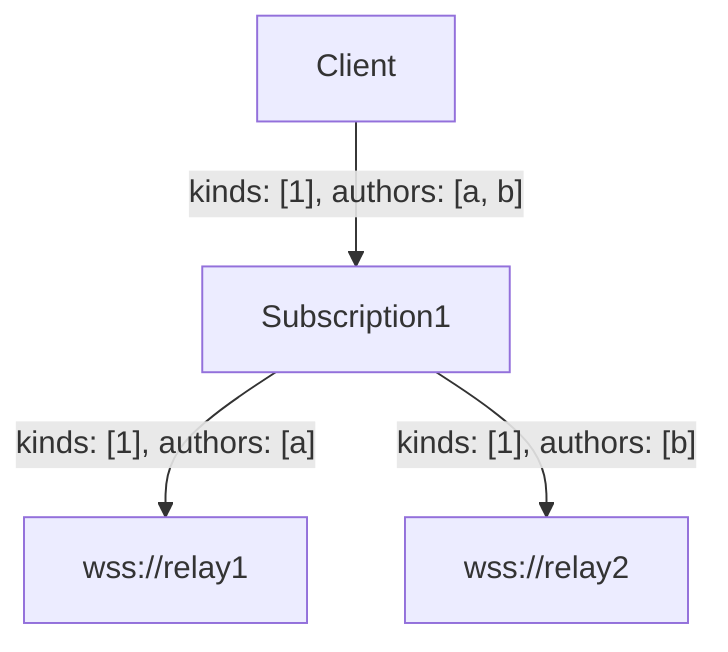
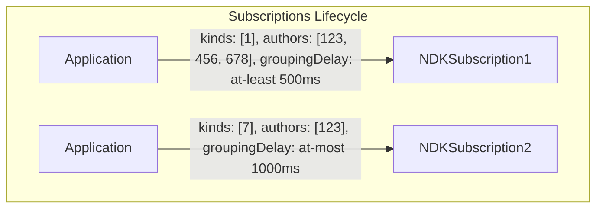
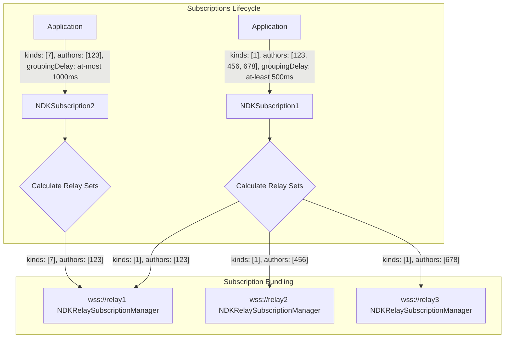
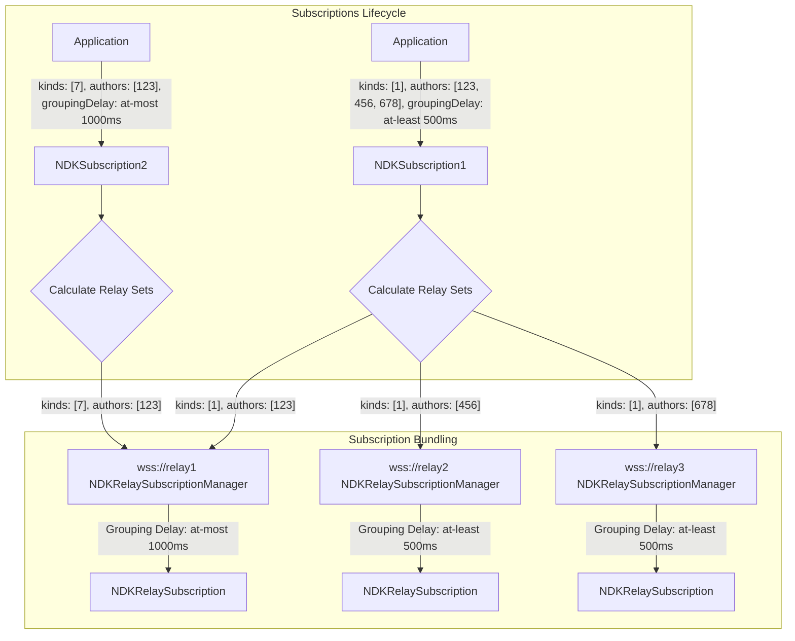
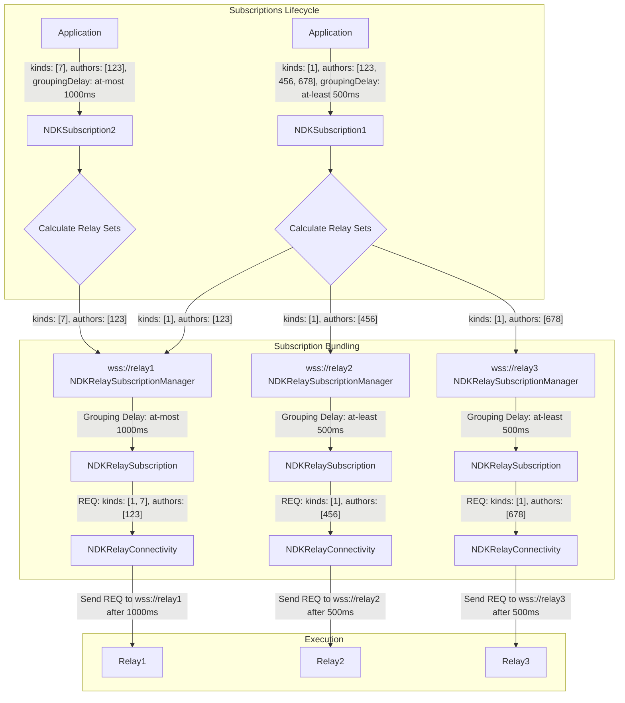
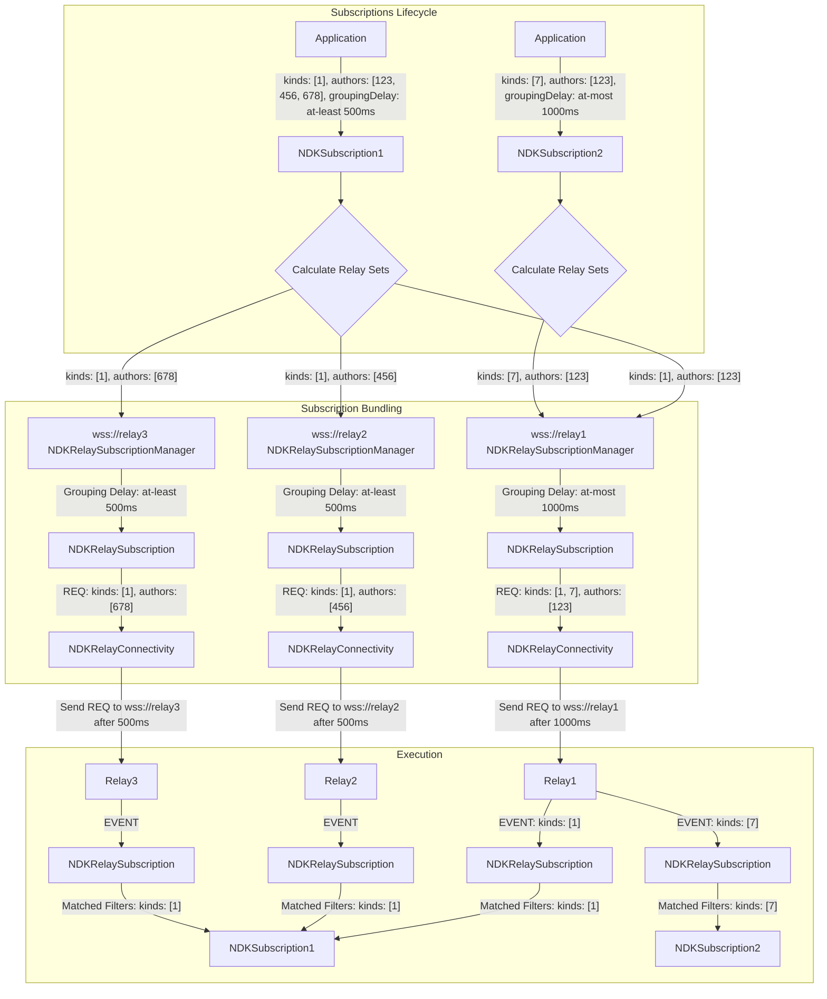

# Subscriptions Lifecycle

When an application creates a subscription a lot of things happen under the hood.

Say we want to see `kind:1` events from pubkeys `123`, `456`, and `678`.

```ts
const subscription = ndk.subscribe({ kinds: [1], authors: ["123", "456", "678"] });
```

Since the application level didn't explicitly provide a relay-set, which is the most common use case, NDK will calculate
a relay set based on the outbox model plus a variety of some other factors.

## Relay Selection for Authors

When a subscription includes an `authors` filter, NDK uses the outbox model to determine which relays to query for each
author. By default, NDK will query **2 relays** for each author, but this can be customized using the
`relayGoalPerAuthor` option:

```ts
// Query 3 relays for each author instead of the default 2
const subscription = ndk.subscribe(
  { kinds: [1], authors: ["123", "456", "678"] },
  { relayGoalPerAuthor: 3 }
);

// Use all available relays for each author
const subscription = ndk.subscribe(
  { kinds: [1], authors: ["123", "456", "678"] },
  { relayGoalPerAuthor: Infinity }
);
```

Higher values improve redundancy and reduce the chance of missing events, but increase bandwidth usage and the number of
relay connections. Lower values reduce resource usage but may miss events if a relay is down or doesn't have the event.
Setting `relayGoalPerAuthor: Infinity` will query all available relays for each author.

So the first thing we'll do before talking to relays is, decide to _which_ relays we should talk to.

The `calculateRelaySetsFromFilters` function will take care of this and provide us with a map of relay URLs and filters
for each relay.

This means that the query, as specified by the client might be broken into distinct queries specialized for the
different relays.

For example, if we have 3 relays, and the query is for `kind:1` events from pubkeys `a` and `b`, the
`calculateRelaySetsFromFilters` function might return something like this:

```ts
{
  "wss://relay1": { kinds: [1], authors: [ "a" ] },
  "wss://relay2": { kinds: [1], authors: [ "b" ] },
}
```



## Subscription bundling

Once the subscription has been split into the filters each relay should receive, the filters are sent to the individual
`NDKRelay`'s `NDKRelaySubscriptionManager` instances.

`NDKRelaySubscriptionManager` is responsible for keeping track of the active and scheduled subscriptions that are
pending to be executed within an individual relay.

This is an important aspect to consider:

> `NDKSubscription` have a different lifecycle than `NDKRelaySubscription`. For example, a subscription that is set to
> close after EOSE might still be active within the `NDKSubscription` lifecycle, but it might have been already been
> closed within the `NDKRelaySubscription` lifecycle, since NDK attempts to keep the minimum amount of open subscriptions
> at any given time.

## NDKRelaySubscription

Most NDK subscriptions (by default) are set to be executed with a grouping delay. Will cover what this looks like in
practice later, but for now, let's understand than when the `NDKRelaySubscriptionManager` receives an order, it might
not execute it right away.

The different filters that can be grouped together (thus executed as a single `REQ` within a relay) are grouped within
the same `NDKRelaySubscription` instance and the execution scheduler is computed respecting what each individual
`NDKSubscription` has requested.

(For example, if a subscription with a `groupingDelay` of `at-least` 500 millisecond has been grouped with another
subscription with a `groupingDelay` of `at-least` 1000 milliseconds, the `NDKRelaySubscriptionManager` will wait 1000 ms
before sending the `REQ` to this particular relay).

### Execution

Once the filter is executed at the relay level, the `REQ` is submitted into that relay's `NDKRelayConnectivity`
instance, which will take care of monitoring for responses for this particular REQ and communicate them back into the
`NDKRelaySubscription` instance.

Each `EVENT` that comes back as a response to our `REQ` within this `NDKRelaySubscription` instance is sent to the
top-level `NDKSubscriptionManager`. This manager tracks ALL active subscriptions and when events come in dispatches the
event to all `NDKSubscription`s interested in this event.

# Example

If an application requests `kind:1` of pubkeys `123`, `456`, and `789`. It creates an `NDKSubscription`:

```ts
ndk.subscribe(
    { kinds: [1], authors: ["123", "456", "789"] },
    { groupableDelay: 500, groupableDelayType: "at-least" }
);
// results in NDKSubscription1 with filters { kinds: [1], authors: [ "123", "456", "789" ] }
```

Some other part of the application requests a kind:7 from pubkey `123` at the same time.

```ts
ndk.subscribe(
    { kinds: [7], authors: ["123"] },
    { groupableDelay: 500, groupableDelayType: "at-most" }
);
// results in NDKSubscription2 with filters { kinds: [7], authors: [ "123" ] }
```



Both subscriptions have their relayset calculated by NDK and, the resulting filters are sent into the
`NDKRelaySubscriptionManager`, which will decide what, and how filters can be grouped.



The `NDKRelaySubscriptionManager` will create `NDKRelaySubscription` instances, or add filters to them if
`NDKRelaySubscription` with the same filter fingerprint exists.



Each individual `NDKRelaySubscription` computes the execution schedule of the filters it has received and sends them to
the `NDKRelayConnectivity` instance, which in turns sends the `REQ` to the relay.



As the events come from the relays, `NDKRelayConnectivity` will send them back to the `NDKRelaySubscription` instance,
which will compare the event with the filters of the `NDKSubscription` instances that have been grouped together and
send the received event back to the correct `NDKSubscription` instance.



## Handling Subscription Events

When creating a subscription using `ndk.subscribe`, you can provide handlers for different stages of the subscription
lifecycle directly within the options or the `autoStart` parameter.

```typescript
interface NDKSubscriptionEventHandlers {
    /**
     * Called for each individual event received after the initial cache load (if applicable)
     * or for all events if onEvents is not provided.
     */
    onEvent?: (event: NDKEvent, relay?: NDKRelay) => void;

    /**
     * Called *once* with all events found synchronously in the cache when the subscription starts.
     * If this handler is provided, `onEvent` will *not* be called for these initial cached events.
     * This is useful for bulk processing or batching UI updates.
     */
    onEvents?: (events: NDKEvent[]) => void;

    /**
     * Called when the subscription receives an EOSE (End of Stored Events) marker
     * from all connected relays for this subscription request.
     */
    onEose?: (sub: NDKSubscription) => void;
}

// Example passing handlers directly (preferred method)
ndk.subscribe(
    filters,
    { // Options can include explicit relays now
        closeOnEose: true,
        // relayUrls: ["wss://explicit.relay"] // Optionally specify relays here
    },
    { // Pass handlers via the autoStart parameter (now the 3rd argument)
        onEvent: (event) => {
            console.log("Received event:", event.id);
        },
        onEvents: (events) => { // Renamed parameter
            console.log(`Received ${events.length} events from cache initially.`);
            // Process the batch of cached events here
        },
        onEose: (subscription) => {
            console.log("Subscription reached EOSE:", subscription.internalId);
        }
    }
);
```

### Bulk Cache Event Handling (`onEvents`)

A key feature is the behavior when using the `onEvents` handler. If NDK has a cache adapter configured and finds events
matching the subscription filter synchronously in the cache upon starting the subscription:

1. The `onEvents` handler will be called exactly once with an array containing all these cached `NDKEvent` objects.
2. The regular `onEvent` handler will *not* be called for this initial batch of cached events.
3. After this initial batch, `onEvent` will be called for any subsequent events received from relays or asynchronous
   cache updates.

This allows applications to efficiently process the initial state from the cache in one go, which can be particularly
beneficial for UI frameworks to avoid multiple re-renders that might occur if `onEvent` were called for each cached item
individually. If `onEvents` is *not* provided, `onEvent` will be called for every event, including those from the cache.
