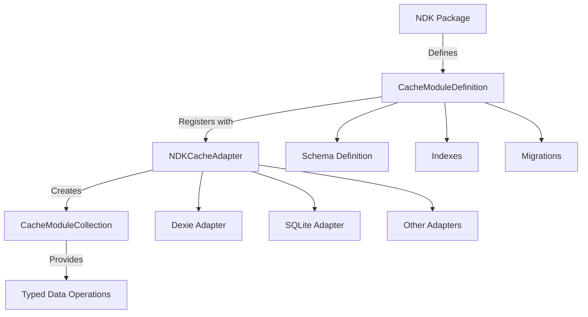

# NDK Cache Module System

The NDK Cache Module System provides a standardized way for packages to extend cache adapters with their own data structures, migrations, and storage requirements. This enables packages to leverage the cache infrastructure without modifying core cache adapter code.

## Table of Contents

- [Overview](#overview)
- [Architecture](#architecture)
- [Creating a Cache Module](#creating-a-cache-module)
- [Using Cache Modules](#using-cache-modules)
- [Cache Adapter Support](#cache-adapter-support)
- [Best Practices](#best-practices)
- [Examples](#examples)
- [API Reference](#api-reference)

## Overview

The cache module system allows NDK packages to:
- Define their own data schemas and collections
- Implement version management and migrations
- Leverage cache adapter features (indexing, querying, persistence)
- Work across different cache implementations (Dexie, SQLite, etc.)

### Key Benefits

1. **Separation of Concerns**: Cache adapters handle I/O, packages define data shapes
2. **Automatic Migrations**: Version management and schema upgrades are handled automatically
3. **Type Safety**: Strongly typed collections and queries through TypeScript
4. **Performance**: Indexed fields for efficient lookups
5. **Modularity**: Multiple packages can register their own modules without conflicts

## Architecture



### Core Components

1. **CacheModuleDefinition**: Defines the module's schema, indexes, and migrations
2. **CacheModuleCollection**: Provides typed data operations for a collection
3. **CacheModuleMigrationContext**: Context for running migrations
4. **CacheModuleStorage**: Bridge between packages and cache modules

## Creating a Cache Module

### 1. Define Your Module

```typescript
import type { CacheModuleDefinition } from '@nostr-dev-kit/ndk';

export const myPackageCacheModule: CacheModuleDefinition = {
    namespace: 'my-package',
    version: 1,

    collections: {
        // Define your collections
        items: {
            primaryKey: 'id',
            indexes: ['userId', 'createdAt'],
            compoundIndexes: [
                ['userId', 'status'], // For efficient user+status queries
            ],
            schema: {
                id: 'string',
                userId: 'string',
                content: 'string',
                status: 'string',
                createdAt: 'number',
                metadata: 'object?', // Optional field
            }
        },

        settings: {
            primaryKey: 'key',
            indexes: ['userId'],
            schema: {
                key: 'string',
                userId: 'string',
                value: 'any',
                updatedAt: 'number',
            }
        }
    },

    migrations: {
        // Version 1: Initial setup
        1: async (context) => {
            await context.createCollection('items', myPackageCacheModule.collections.items);
            await context.createCollection('settings', myPackageCacheModule.collections.settings);
        },

        // Version 2: Add new field (example future migration)
        // 2: async (context) => {
        //     await context.addIndex('items', 'priority');
        // }
    }
};
```

### 2. Create TypeScript Types

```typescript
// Derive types from your schema
export interface CachedItem {
    id: string;
    userId: string;
    content: string;
    status: 'pending' | 'active' | 'completed';
    createdAt: number;
    metadata?: Record<string, any>;
}

export interface CachedSetting {
    key: string;
    userId: string;
    value: any;
    updatedAt: number;
}
```

### 3. Create a Storage Adapter

```typescript
import type { NDKCacheAdapter, CacheModuleCollection } from '@nostr-dev-kit/ndk';

export class MyPackageStorage {
    private itemsCollection?: CacheModuleCollection<CachedItem>;
    private settingsCollection?: CacheModuleCollection<CachedSetting>;
    private initialized = false;

    constructor(
        private cache: NDKCacheAdapter,
        private userId: string
    ) {}

    private async ensureInitialized(): Promise<void> {
        if (this.initialized) return;

        // Register the module if supported
        if (this.cache.registerModule) {
            await this.cache.registerModule(myPackageCacheModule);
        }

        // Get collections if supported
        if (this.cache.getModuleCollection) {
            this.itemsCollection = await this.cache.getModuleCollection<CachedItem>(
                'my-package',
                'items'
            );
            this.settingsCollection = await this.cache.getModuleCollection<CachedSetting>(
                'my-package',
                'settings'
            );
        }

        this.initialized = true;
    }

    async saveItem(item: CachedItem): Promise<void> {
        await this.ensureInitialized();
        if (!this.itemsCollection) return;

        await this.itemsCollection.save(item);
    }

    async getItemsByUser(userId: string): Promise<CachedItem[]> {
        await this.ensureInitialized();
        if (!this.itemsCollection) return [];

        return await this.itemsCollection.findBy('userId', userId);
    }

    async getActiveItemsByUser(userId: string): Promise<CachedItem[]> {
        await this.ensureInitialized();
        if (!this.itemsCollection) return [];

        return await this.itemsCollection.where({
            userId,
            status: 'active'
        });
    }
}
```

## Using Cache Modules

### In Your Package

```typescript
import NDK from '@nostr-dev-kit/ndk';
import NDKCacheAdapterDexie from '@nostr-dev-kit/cache-dexie';
import { MyPackageStorage } from './storage';

// Initialize NDK with cache
const cacheAdapter = new NDKCacheAdapterDexie({
    dbName: 'my-app'
});

const ndk = new NDK({
    cacheAdapter,
    // ... other options
});

// Create your package with cache support
class MyPackage {
    private storage: MyPackageStorage;

    constructor(ndk: NDK, userId: string) {
        // Use cache if available, fallback to memory storage
        this.storage = new MyPackageStorage(
            ndk.cacheAdapter || new MemoryAdapter(),
            userId
        );
    }

    async saveItem(content: string): Promise<void> {
        const item: CachedItem = {
            id: generateId(),
            userId: this.userId,
            content,
            status: 'pending',
            createdAt: Date.now(),
        };

        await this.storage.saveItem(item);
    }
}
```

### With Fallback Support

```typescript
// Support both cache modules and basic storage
export class AdaptiveStorage {
    constructor(
        private cache: NDKCacheAdapter,
        private userId: string
    ) {}

    async save(key: string, data: any): Promise<void> {
        // Try cache module first
        if (this.cache.getModuleCollection) {
            const collection = await this.cache.getModuleCollection(
                'my-package',
                'data'
            );
            await collection.save({ id: key, ...data });
        }
        // Fallback to generic cache storage
        else if (this.cache.setCacheData) {
            await this.cache.setCacheData('my-package', key, data);
        }
        // Fallback to in-memory
        else {
            this.memoryCache.set(key, data);
        }
    }
}
```

## Cache Adapter Support

### Implementing Module Support in Cache Adapters

Cache adapters need to implement two methods to support modules:

```typescript
class MyCacheAdapter implements NDKCacheAdapter {
    // ... other NDKCacheAdapter methods ...

    async registerModule(module: CacheModuleDefinition): Promise<void> {
        // 1. Check current version
        const currentVersion = await this.getModuleVersion(module.namespace);

        // 2. Run migrations from current to target version
        for (let v = currentVersion + 1; v <= module.version; v++) {
            if (module.migrations[v]) {
                const context = this.createMigrationContext(module, v);
                await module.migrations[v](context);
            }
        }

        // 3. Update module metadata
        await this.saveModuleMetadata(module);
    }

    async getModuleCollection<T>(
        namespace: string,
        collection: string
    ): Promise<CacheModuleCollection<T>> {
        // Return a collection interface for the requested namespace/collection
        return new MyCollectionImpl<T>(namespace, collection);
    }
}
```

### Currently Supported Adapters

| Adapter | Module Support | Status |
|---------|---------------|--------|
| cache-dexie | ✅ Full | Production Ready |
| cache-sqlite | 🚧 Planned | In Development |
| cache-memory | 🚧 Planned | In Development |
| cache-redis | 🚧 Planned | In Development |

## Best Practices

### 1. Namespace Everything

Always use your package name as the namespace to avoid conflicts:

```typescript
// Good
namespace: '@mycompany/mypackage'

// Bad
namespace: 'data' // Too generic
```

### 2. Plan Your Schema

Think about indexes and queries upfront:

```typescript
collections: {
    messages: {
        primaryKey: 'id',
        indexes: [
            'conversationId', // For fetching conversation messages
            'timestamp',      // For sorting
            'sender',        // For filtering by sender
        ],
        compoundIndexes: [
            ['conversationId', 'timestamp'], // Efficient conversation queries
            ['recipient', 'read'],           // Unread messages for user
        ]
    }
}
```

### 3. Version Carefully

Always increment version for schema changes:

```typescript
migrations: {
    1: async (ctx) => {
        // Initial schema
    },
    2: async (ctx) => {
        // Add new field - data migration if needed
        await ctx.addIndex('messages', 'priority');

        // Migrate existing data
        const messages = await ctx.getCollection('messages');
        const all = await messages.all();
        for (const msg of all) {
            msg.priority = msg.priority || 'normal';
            await messages.save(msg);
        }
    }
}
```

### 4. Handle Missing Support Gracefully

Always check for module support:

```typescript
if (cache.registerModule) {
    // Use module system
    await cache.registerModule(myModule);
} else {
    // Fallback to basic storage or in-memory
    console.warn('Cache modules not supported, using fallback');
}
```

### 5. Keep Migrations Idempotent

Migrations should be safe to run multiple times:

```typescript
migrations: {
    2: async (context) => {
        // Check if already migrated
        const collection = await context.getCollection('data');
        const sample = await collection.get('sample-id');

        if (!sample?.newField) {
            // Perform migration
            const all = await collection.all();
            for (const item of all) {
                item.newField = calculateDefault(item);
                await collection.save(item);
            }
        }
    }
}
```

## Examples

### Real-World Example: Messages Package

The `@nostr-dev-kit/messages` package uses cache modules for persistent messaging:

```typescript
export const messagesCacheModule: CacheModuleDefinition = {
    namespace: 'messages',
    version: 1,

    collections: {
        messages: {
            primaryKey: 'id',
            indexes: ['conversationId', 'timestamp', 'sender', 'recipient'],
            compoundIndexes: [
                ['conversationId', 'timestamp'],
                ['recipient', 'read'],
            ],
        },

        conversations: {
            primaryKey: 'id',
            indexes: ['lastMessageAt'],
            compoundIndexes: [['participants']],
        },

        dmRelays: {
            primaryKey: 'pubkey',
            indexes: ['updatedAt'],
        }
    },

    migrations: {
        1: async (context) => {
            await context.createCollection('messages', messagesCacheModule.collections.messages);
            await context.createCollection('conversations', messagesCacheModule.collections.conversations);
            await context.createCollection('dmRelays', messagesCacheModule.collections.dmRelays);
        }
    }
};
```

### Testing Cache Modules

```typescript
import { describe, it, expect } from 'vitest';
import { MyPackageCacheModule } from './cache-module';
import { TestCacheAdapter } from '@nostr-dev-kit/test-utils';

describe('My Package Cache Module', () => {
    it('should register and migrate correctly', async () => {
        const cache = new TestCacheAdapter();

        await cache.registerModule(MyPackageCacheModule);

        const version = await cache.getModuleVersion('my-package');
        expect(version).toBe(1);

        const collection = await cache.getModuleCollection('my-package', 'items');

        await collection.save({ id: '1', data: 'test' });
        const item = await collection.get('1');

        expect(item).toHaveProperty('data', 'test');
    });
});
```

## API Reference

### CacheModuleDefinition

```typescript
interface CacheModuleDefinition {
    namespace: string;  // Unique identifier for your module
    version: number;    // Current schema version

    collections: {
        [name: string]: {
            primaryKey: string;
            indexes?: string[];
            compoundIndexes?: string[][];
            schema?: Record<string, any>;
        }
    };

    migrations: {
        [version: number]: (context: CacheModuleMigrationContext) => Promise<void>;
    };
}
```

### CacheModuleCollection

```typescript
interface CacheModuleCollection<T> {
    // Single item operations
    get(id: string): Promise<T | null>;
    save(item: T): Promise<void>;
    delete(id: string): Promise<void>;

    // Bulk operations
    getMany(ids: string[]): Promise<T[]>;
    saveMany(items: T[]): Promise<void>;
    deleteMany(ids: string[]): Promise<void>;

    // Query operations
    findBy(field: string, value: any): Promise<T[]>;
    where(conditions: Record<string, any>): Promise<T[]>;
    all(): Promise<T[]>;
    count(conditions?: Record<string, any>): Promise<number>;
    clear(): Promise<void>;
}
```

### CacheModuleMigrationContext

```typescript
interface CacheModuleMigrationContext {
    fromVersion: number;
    toVersion: number;

    getCollection(name: string): Promise<CacheModuleCollection<any>>;
    createCollection(name: string, definition: CollectionDefinition): Promise<void>;
    deleteCollection(name: string): Promise<void>;
    addIndex(collection: string, field: string | string[]): Promise<void>;
}
```

## Troubleshooting

### Module Not Found Error

```typescript
Error: Module my-package not registered
```

**Solution**: Ensure you call `registerModule` before accessing collections:

```typescript
await cache.registerModule(myModule);
const collection = await cache.getModuleCollection('my-package', 'data');
```

### Migration Failed

```typescript
Error: Migration 2 failed: Cannot add index to non-existent field
```

**Solution**: Ensure migrations are in order and handle missing data:

```typescript
migrations: {
    2: async (context) => {
        // First ensure the field exists
        const collection = await context.getCollection('data');
        const items = await collection.all();

        for (const item of items) {
            if (!item.newField) {
                item.newField = defaultValue;
                await collection.save(item);
            }
        }

        // Then add index
        await context.addIndex('data', 'newField');
    }
}
```

### Performance Issues

If queries are slow, ensure you have proper indexes:

```typescript
// Slow: no index on userId
await collection.where({ userId: 'abc' });

// Fast: with index
collections: {
    items: {
        primaryKey: 'id',
        indexes: ['userId'], // Add this
    }
}
```

## Contributing

To add cache module support to a new cache adapter:

1. Implement `registerModule()` and `getModuleCollection()` methods
2. Add tests using the standard test suite
3. Update this documentation
4. Submit a pull request

## Related Documentation

- [NDK Cache Adapters](./cache-adapters.md)
- [Creating NDK Packages](./creating-packages.md)
- [Messages Package Example](../messages/README.md)