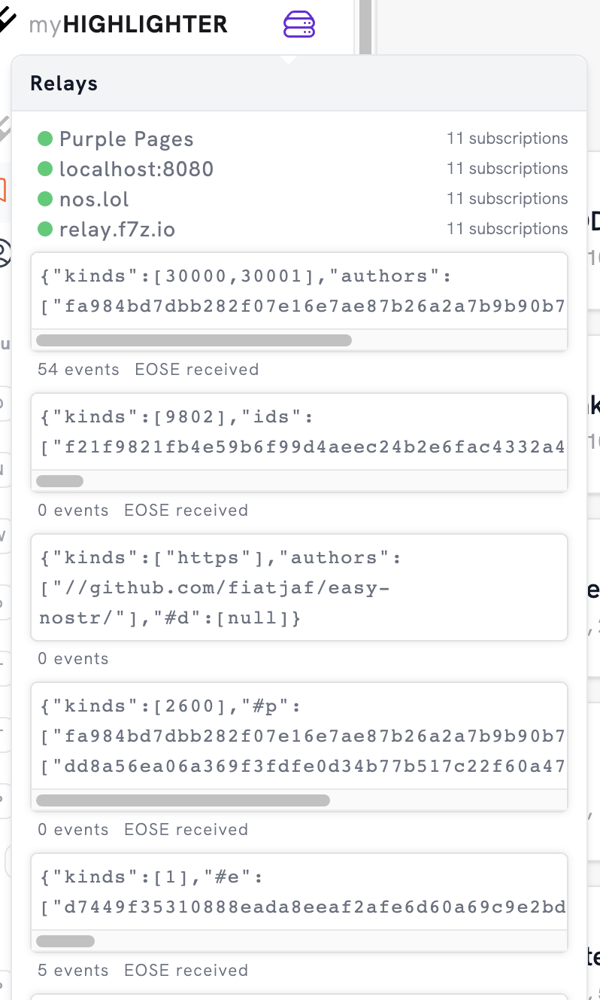

# ndk-svelte-components

Reusable Svelte components.

## Installation

```
# With npm
npm add @nostr-dev-kit/ndk-svelte-components

# With pnpm
pnpm add @nostr-dev-kit/ndk-svelte-components

# With yarn
yarn install @nostr-dev-kit/ndk-svelte-components
```

## Storybook

This project uses `pnpm` to manage dependencies.

```
git clone https://github.com/nostr-dev-kit/ndk-svelte-components
cd ndk-svelte-components
pnpm i
pnpm run storybook
```

# Components

## Event

### `<EventCard>`

Displays a card with formatted event content.

### `<EventContent>`

Formats the content of an event for an `EventCard`. Currently supports:

-   kind 1 events
-   Embedded kind 1 events in other kind 1 events

## User

### `<Avatar>`

Displays a user's avatar

### `<Name>`

Displays a user's name

## Relay

### `<RelayList ndk />`

Displays a list of relays the NDK instance is connected to, along with information about active subscriptions and connectivity stats.



# License

MIT

# Author

-   pablof7z ([npub1l2vyh47mk2p0qlsku7hg0vn29faehy9hy34ygaclpn66ukqp3afqutajft](https://primal.net/pablof7z))
-   jeffg ([npub1zuuajd7u3sx8xu92yav9jwxpr839cs0kc3q6t56vd5u9q033xmhsk6c2uc](https://primal.net/jeffg))
